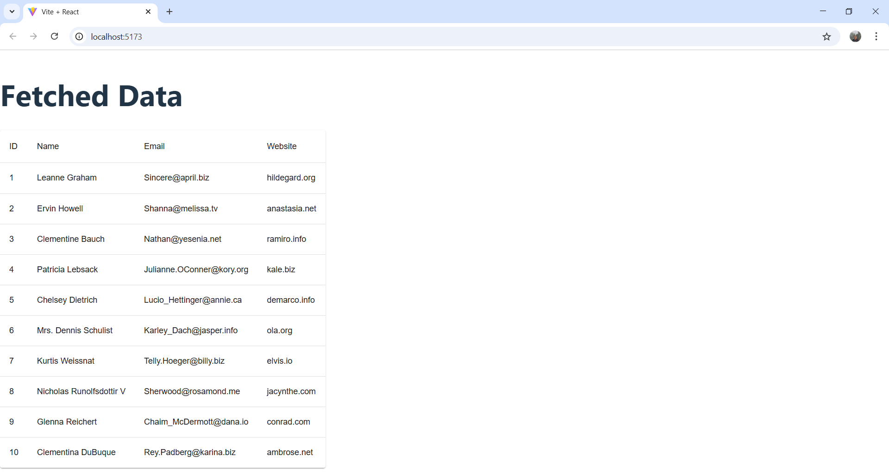
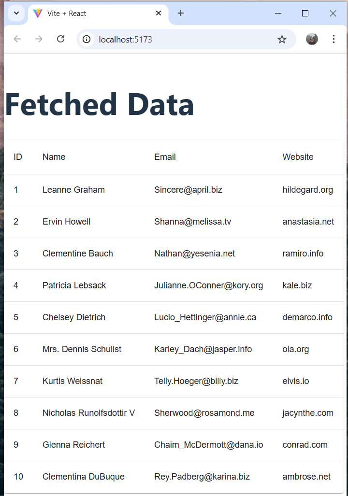

# 1. Give an example of an async await based function to fetch data from the JSON placeholder API ? (https://jsonplaceholder.typicode.com/)
# Answer:- 
```javascript
import { useState, useEffect } from 'react';

const App = () => {
  const [data, setData] = useState([]);
  const [loading, setLoading] = useState(true); 
  const [error, setError] = useState(null);

  
  useEffect(() => {
    const fetchData = async () => {
      try {
        const response = await fetch('https://jsonplaceholder.typicode.com/users'); 
        if (!response.ok) {
          throw new Error('Network response was not ok');
        }
        const data = await response.json(); 
        setData(data); 
      } catch (error) {
        setError(error.message); 
      } finally {
        setLoading(false); 
      }
    };

    fetchData(); 
  }, []); 

  
  if (loading) return <p>Loading...</p>;
  if (error) return <p>Error: {error}</p>;

  return (
    <div>
      <h1>Fetched Data</h1>
      <ul>
        {data.map(data=>(
          <li key={data.id}>
            <h2>{data.name}</h2>
            <p>{data.body}</p>
          </li>
        ))}
      </ul>
    </div>
  );
};

export default App;
```


# 2. Display the results from above in a MUI table that takes half of the screen width on a laptop screens and full screen width on mobile screen ?
# Answer:
  # Output for Laptop Screen
 

  # Output for Mobile screen
  


# 3. How do you pass the redux store to the react js page ?
# Answer:
In React, the Redux store is passed using the <Provider> component from react-redux. This makes the store accessible to all components in the application.
# Steps:
   # 1. Wrap App with Provider
        import { Provider } from "react-redux";
        import store from "./store";

        <Provider store={store}>
          <App />
        </Provider>;
   # 2. Access Redux State in a Component
        import { useSelector, useDispatch } from "react-redux";
        import { actionName } from "./sliceFile";

        const Component = () => {
          const value = useSelector((state) => state.reducerName.value);
          const dispatch = useDispatch();

          return <button onClick={() => dispatch(actionName())}>Click</button>;
        };

  # 4. What would be the prompt you would write if you had to display the above table in react js in the form of a mindmap.
  # Answer:
      "Create a React component that visualizes tabular data as a mind map. Use a hierarchical structure where
      the main topic is the table's title, and sub-nodes represent each row with key details. Ensure responsiveness
      with Tailwind CSS, and use a library like react-flow for visualization."

 # Key Features of the Mind Map:
   ✅ Root Node → Table title (e.g., "Users Data")
   
   ✅ Branch Nodes → Each row represents a user
   
   ✅ Child Nodes → User details like name, email, etc.
   
   ✅ Library → react-flow for visualization
   
   ✅ Styling → Tailwind CSS

# NOTE: Code of question 1,2,4 in code files,You have to just uncomment Code according to question number and run "npm run dev".
      
